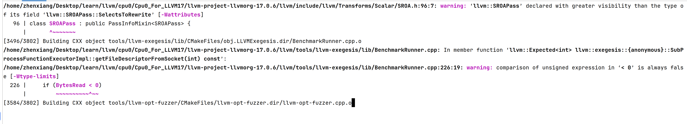
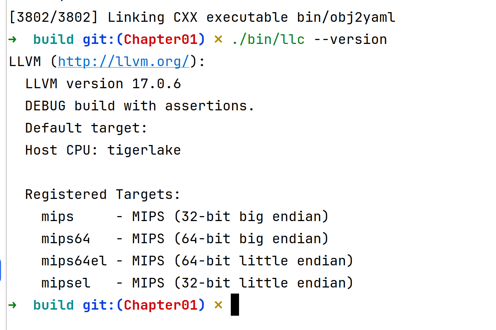
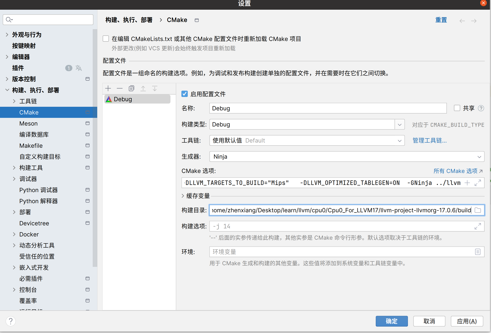
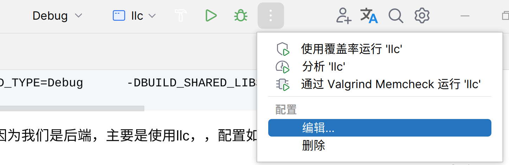
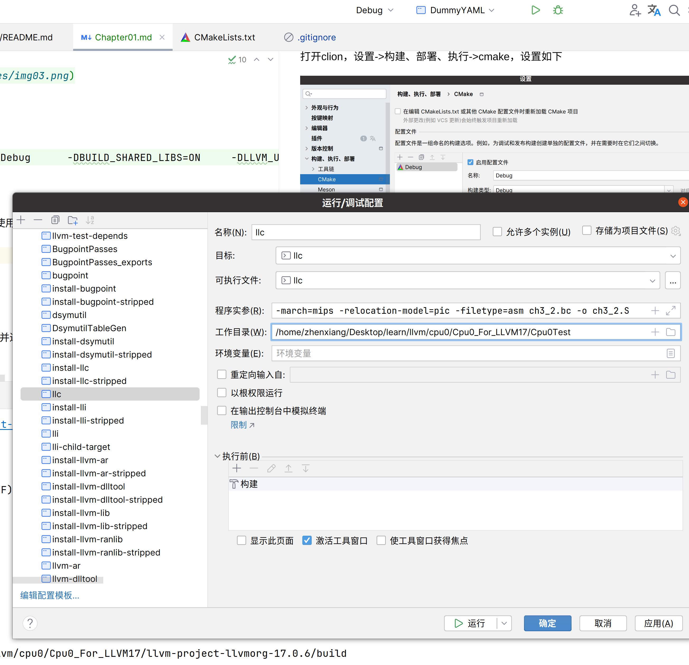

# Overview

本章是第一章，主要是一些准备工作，首先是将初始代码解压，先编译构建代码，然后是对clion的设置，后面有时调试代码，使用clion更方便一些，本机系统环境是ubuntu20.04，推荐32g内存以上。

# 编译构建

为了提升速度，我们使用lld链接，以及使用ninja来替代make。只编译mips后端，我们的cpu0后端大部分和mips类似，我们需要和mips对照，所以我们只需要编译mips即可

安装依赖

```shell
sudo apt install ninja-build

sudo apt install lld
```

以及cmake，这里不叙述cmake怎么安装了，参考[官网](https://cmake.org/download/)

编译选项

```shell
# 在llvm源码目录下
mkdir build && cd build
# 编译llvm
cmake -DCMAKE_BUILD_TYPE=Debug         \
        -DBUILD_SHARED_LIBS=ON         \
        -DLLVM_USE_LINKER=lld          \
        -DLLVM_ENABLE_PROJECTS="clang" \
        -DLLVM_TARGETS_TO_BUILD="Mips"   \
        -DLLVM_OPTIMIZED_TABLEGEN=ON   \
        -GNinja ../llvm && ninja

```

编译过程如下，大概10多分钟




如果编译成功，输入以下命令

```shell
./bin/llc --version 
```

如下显示




# Clion设置

因为后面有时会使用clion调试，我们这里对clion进行一些设置。

打开clion，设置->构建、部署、执行->cmake，设置如下



cmake选项如下：

因为我们还没有在源码设置Cpu0后端，所以只有Mips

```text
-DCMAKE_BUILD_TYPE=Debug      -DBUILD_SHARED_LIBS=ON     -DLLVM_USE_LINKER=lld       -DLLVM_ENABLE_PROJECTS="clang"    -DLLVM_TARGETS_TO_BUILD="Mips"   -DLLVM_OPTIMIZED_TABLEGEN=ON  -GNinja ../llvm
```

运行/调试 配置
因为我们是后端开发，主要是使用llc，，配置如下

点击右上角



具体设置如下，在左侧很多的可执行程序中找到llc




我们这里只是编译了llvm并进行了clion的设置，从下一章开始，我们将正式开始cpu0后端的开发。