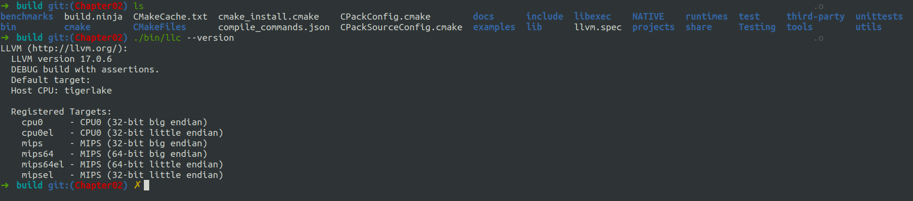

# Overview

本章节主要是构建一个名为Cpu0的Target，也就是说可以通过之前使用的llc --version命令查到。

当前，我们并不是一蹴而就，不会马上就实现完整的cpu0的Target。但是即便这样，内容依然很多，如果有什么不懂，可以暂存着疑惑（也可以去看learn llvm17 有关后端部分的章节），到后面的章节就明白了。


按照书上的步骤依次添加以下文件或者添加相应的代码


# 细节

我们的代码与书配套的代码略微不同。
(以下无特殊说明，均表示在llvm-project-llvmorg-17.0.6目录下，版本不同，有些文件位置有变化，以仓库实际代码为主，行数表示在附近，并不完全准确)

## Cpu0 backend machine ID and relocation records


- llvm/cmake/config-ix.cmake   line495
- llvm/CMakeLists.txt   line439
- llvm/include/llvm/TargetParser/Triple.h  line68
- llvm/include/llvm/Object/ELFObjectFile.h line1211 1297
- llvm/include/llvm/BinaryFormat/ELF.h  line323 607
- llvm/lib/MC/MCSubtargetInfo.cpp line58 84 192 214 294 328
- llvm/lib/MC/SubtargetFeature.cpp 注意这个文件合并到上面那个文件里面了
- llvm/lib/Object/ELF.cpp line54
- llvm/include/llvm/BinaryFormat/ELFRelocs/Cpu0.def 整个文件
- llvm/lib/TargetParser/Triple.cpp line55 124 354 509 842 1428 1521 1593 1701 1740 1785 


## Creating the Initial Cpu0 .td Files

- llvm/lib/Target/Cpu0/Cpu0.td 整个文件
- llvm/lib/Target/Cpu0/Cpu0Other.td 整个文件
- llvm/lib/Target/Cpu0/Cpu0RegisterInfo.td 整个文件
- llvm/lib/Target/Cpu0/Cpu0RegisterInfoGPROutForOther.td 整个文件
- llvm/lib/Target/Cpu0/Cpu0InstrInfo.td 整个文件
- llvm/lib/Target/Cpu0/Cpu0InstrFormats.td 整个文件
- llvm/lib/Target/Cpu0/Cpu0Schedule.td 整个文件


## Target Registration

- llvm/lib/Target/Cpu0/Cpu0.h
- llvm/lib/Target/Cpu0/Cpu0TargetMachine.h
- llvm/lib/Target/Cpu0/Cpu0TargetMachine.cpp
- llvm/lib/Target/Cpu0/TargetInfo/Cpu0TargetInfo.h
- llvm/lib/Target/Cpu0/TargetInfo/Cpu0TargetInfo.cpp
- llvm/lib/Target/Cpu0/MCTargetDesc/Cpu0MCTargetDesc.h
- llvm/lib/Target/Cpu0/MCTargetDesc/Cpu0MCTargetDesc.cpp

## Write cmake file

- llvm/lib/Target/Cpu0/CMakeLists.txt
- llvm/lib/Target/Cpu0/MCTargetDesc/CMakeLists.txt
- llvm/lib/Target/Cpu0/TargetInfo/CMakeLists.txt


总共修改或添加27个文件代码

# 编译

在build目录下输入
```shell
cmake -DCMAKE_BUILD_TYPE=Debug         \
        -DBUILD_SHARED_LIBS=ON         \
        -DLLVM_USE_LINKER=lld          \
        -DLLVM_ENABLE_PROJECTS="clang" \
        -DLLVM_TARGETS_TO_BUILD="Mips;Cpu0"   \
        -DLLVM_OPTIMIZED_TABLEGEN=ON   \
        -GNinja ../llvm && ninja
```

等待十多分钟，等待编译完成，然后输入以下命令

```shell
./bin/llc --version
```





可以看到已经有了cpu0这个Target

本章结束