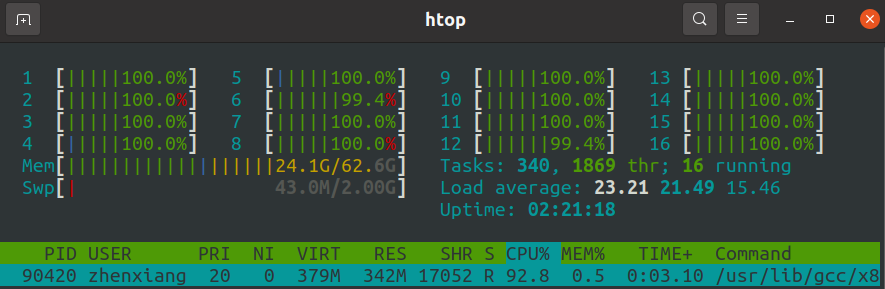
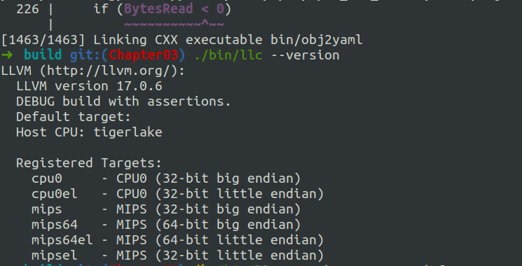
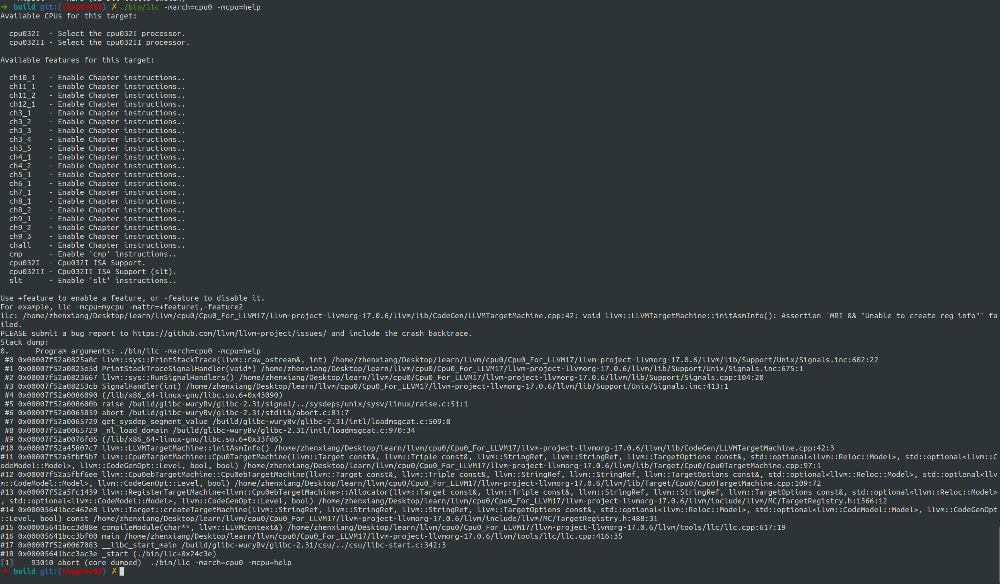

# Overview

这章内容比较多，而且对新手也不友好（我自己在这章卡了相当长的时间，不过所幸也锻炼了调试llvm的能力，如果遇到哪个编译或者链接出错，可以把本仓库当成答案来对照），如果对概念陌生的话，可以先看learn LLVM17或者去YouTube找llvm官方的频道看后端相关的视频（官网文档也行，不过也不是很友好）介绍。

我们按照书上的章节分成多个部分来逐步构建。

# 细节

以下路径均表示在llvm/lib/Target/Cpu0目录下

- Cpu0TargetObjectFile.h 
- Cpu0TargetObjectFile.cpp
- Cpu0TargetMachine.h
- Cpu0TargetMachine.cpp
- Cpu0.td
- Cpu0CallingConv.td
- Cpu0FrameLowering.h
- Cpu0FrameLowering.cpp
- Cpu0SEFrameLowering.h
- Cpu0SEFrameLowering.cpp
- Cpu0InstrInfo.h
- Cpu0InstrInfo.cpp
- Cpu0InstrInfo.td
- Cpu0SEInstrInfo.h
- Cpu0SEInstrInfo.cpp
- Cpu0ISelLowering.h
- Cpu0ISelLowering.cpp
- Cpu0SEISelLowering.h
- Cpu0SEISelLowering.cpp
- Cpu0MachineFunction.h
- Cpu0MachineFunction.cpp
- MCTargetDesc/Cpu0ABIInfo.h
- MCTargetDesc/Cpu0ABIInfo.cpp
- Cpu0Subtarget.h
- Cpu0Subtarget.cpp
- Cpu0RegisterInfo.h
- Cpu0RegisterInfo.cpp
- Cpu0SERegisterInfo.h
- Cpu0SERegisterInfo.cpp
- CMakeLists.txt
- MCTargetDesc/CMakeLists.txt
- Cpu0MCTargetDesc.h
- Cpu0MCTargetDesc.cpp

共计33个文件

# 构建

依旧是在build目录下

```shell
cmake -DCMAKE_BUILD_TYPE=Debug         \
        -DBUILD_SHARED_LIBS=ON         \
        -DLLVM_USE_LINKER=lld          \
        -DLLVM_ENABLE_PROJECTS="clang" \
        -DLLVM_TARGETS_TO_BUILD="Mips;Cpu0"   \
        -DLLVM_OPTIMIZED_TABLEGEN=ON   \
        -GNinja ../llvm && ninja
```


等待十多分钟，等待编译完成（可以看到编译期间有很多紫色警告，不过问题不大，只要不是红色报错就行），


所有cpu都在工作，拉满了。
然后输入以下命令

```shell
./bin/llc --version
```



```shell
./bin/llc -march=cpu0 -mcpu=help
```


