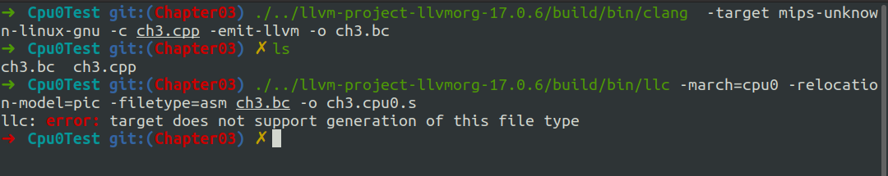

# Overview

本节内容是给我们的后端cpu0添加汇编打印功能。


# 细节

以下路径均表示在llvm/lib/Target/Cpu0目录下

- InstPrinter/Cpu0InstPrinter.h
- InstPrinter/Cpu0InstPrinter.cpp
- InstPrinter/CMakeLists.txt
- Cpu0MCInstLower.h
- Cpu0MCInstLower.cpp
- MCTargetDesc/Cpu0BaseInfo.h
- MCTargetDesc/Cpu0MCAsmInfo.h
- MCTargetDesc/Cpu0MCAsmInfo.cpp
- MCTargetDesc/Cpu0MCTargetDesc.h
- MCTargetDesc/Cpu0MCTargetDesc.cpp
- MCTargetDesc/CMakeLists.txt
- Cpu0AsmPrinter.h
- Cpu0AsmPrinter.cpp
- Cpu0ISelLowering.cpp
- Cpu0MachineFunction.h
- Cpu0MachineFunction.cpp
- CMakeLists.txt


共计17个文件

这里提一下，Cpu0MachineFunction.h/cpp需要修改Cpu0FunctionInfo类的定义。

# 构建

依旧是在build目录下

```shell
cmake -DCMAKE_BUILD_TYPE=Debug         \
        -DBUILD_SHARED_LIBS=ON         \
        -DLLVM_USE_LINKER=lld          \
        -DLLVM_ENABLE_PROJECTS="clang" \
        -DLLVM_TARGETS_TO_BUILD="Mips;Cpu0"   \
        -DLLVM_OPTIMIZED_TABLEGEN=ON   \
        -GNinja ../llvm && ninja
```

这次编译比较快，是因为我们只需要编译修改或新增的代码文件即可。

进入到Cpu0Test目录下，可以看到有一个ch3.cpp文件，我们使用它来进行测试
```shell
./../llvm-project-llvmorg-17.0.6/build/bin/clang  -target mips-unknown-linux-gnu -c ch3.cpp -emit-llvm -o ch3.bc
./../llvm-project-llvmorg-17.0.6/build/bin/llc -march=cpu0 -relocation-model=pic -filetype=asm ch3.bc -o ch3.cpu0.s
```

结果如下：




和书上一致