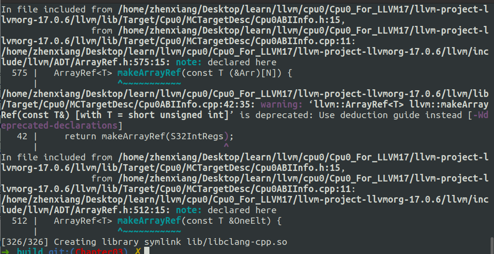
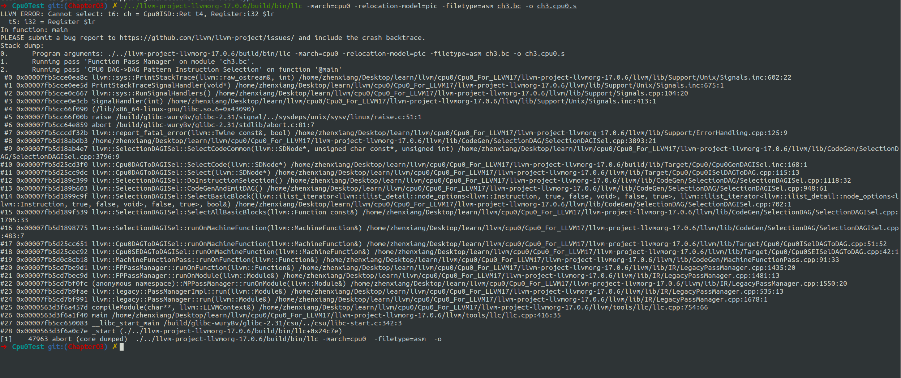

# Overview

添加Cpu0DAGToDAGISel类


# 细节

- CMakeLists.txt
- Cpu0TargetMachine.cpp
- Cpu0ISelDAGToDAG.h
- Cpu0ISelDAGToDAG.cpp
- Cpu0SEISelDAGToDAG.h
- Cpu0ISelDAGToDAG.cpp
- Cpu0Subtarget.h
- Cpu0InstrInfo.td


共计8个文件

值得一说的是，Cpu0InstrInfo.td里面有两处修改成
`->getAlign().value()`，可以看git commit的差异。


# 编译

依旧是在build目录下

```shell
cmake -DCMAKE_BUILD_TYPE=Debug         \
        -DBUILD_SHARED_LIBS=ON         \
        -DLLVM_USE_LINKER=lld          \
        -DLLVM_ENABLE_PROJECTS="clang" \
        -DLLVM_TARGETS_TO_BUILD="Mips;Cpu0"   \
        -DLLVM_OPTIMIZED_TABLEGEN=ON   \
        -GNinja ../llvm && ninja
```

这次编译比较快，是因为我们只需要编译修改或新增的代码文件即可。



进入到Cpu0Test目录下，我们上一小节已经用clang编译得到一个ir文件也就是ch3.bc，我们使用它来进行测试
```shell
./../llvm-project-llvmorg-17.0.6/build/bin/llc -march=cpu0 -relocation-model=pic -filetype=asm ch3.bc -o ch3.cpu0.s
```

结果如下：



和书上完全一致。

