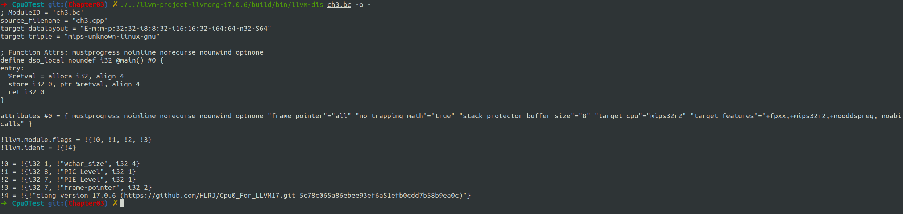
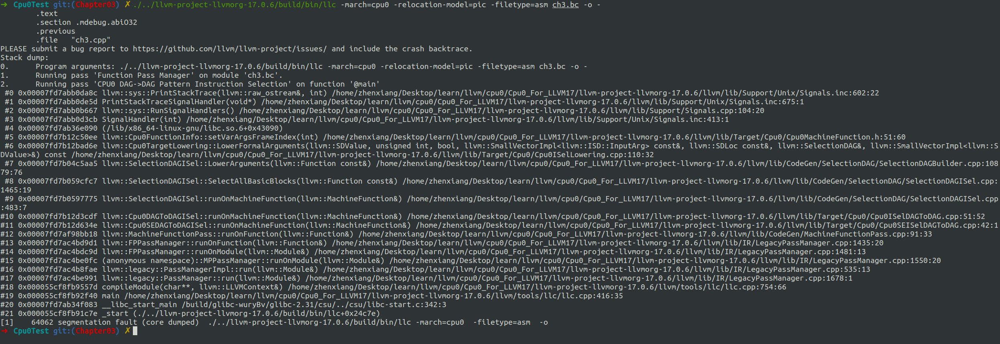
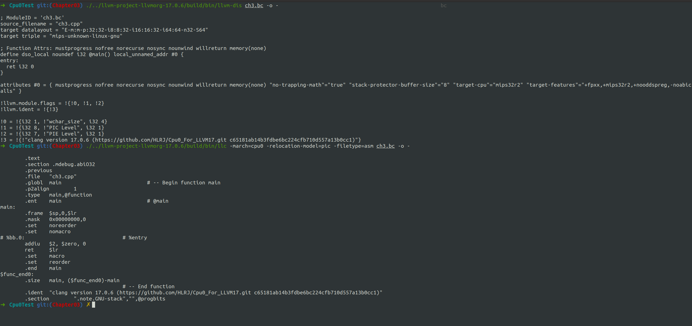
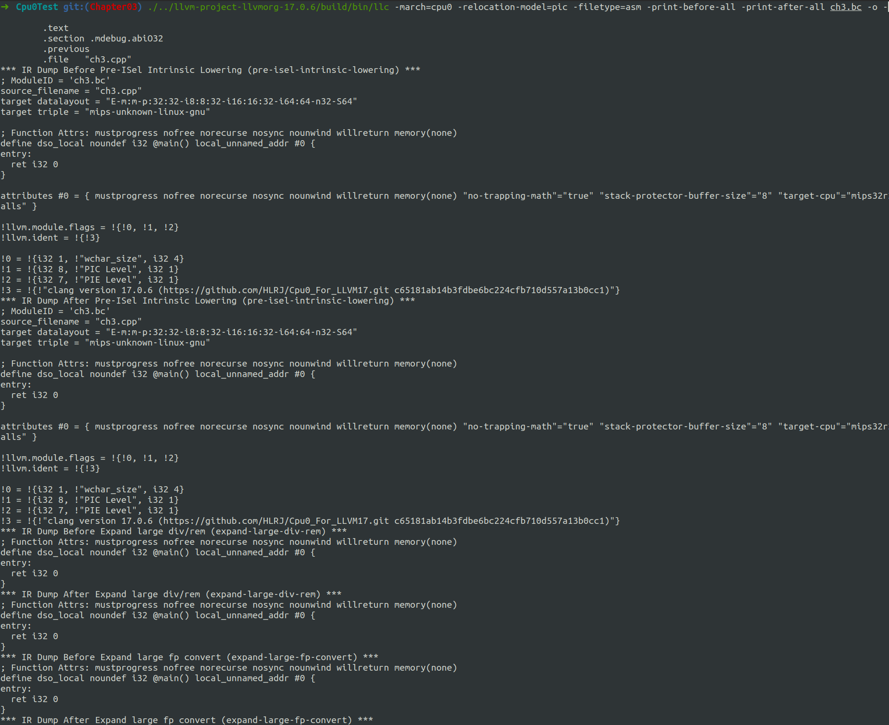

# Overview

Handle return register $lr


# 细节

- Cpu0CallingConv.td
- Cpu0InstrFormats.td
- Cpu0InstrInfo.td
- Cpu0ISelLowering.h
- Cpu0ISelLowering.cpp
- Cpu0MachineFunction.h
- Cpu0SEInstrInfo.h
- Cpu0SEInstrInfo.cpp
- Cpu0Subtarget.h
- Cpu0TargetMachine.h
- Cpu0TargetMachine.cpp


共计11个文件


# 编译

依旧是在build目录下

```shell
cmake -DCMAKE_BUILD_TYPE=Debug         \
        -DBUILD_SHARED_LIBS=ON         \
        -DLLVM_USE_LINKER=lld          \
        -DLLVM_ENABLE_PROJECTS="clang" \
        -DLLVM_TARGETS_TO_BUILD="Mips;Cpu0"   \
        -DLLVM_OPTIMIZED_TABLEGEN=ON   \
        -GNinja ../llvm && ninja
```


进入到Cpu0Test目录下，我们上一小节已经用clang编译得到一个ir文件也就是ch3.bc，我们使用它来进行测试
```shell
./../llvm-project-llvmorg-17.0.6/build/bin/llvm-dis ch3.bc -o -
./../llvm-project-llvmorg-17.0.6/build/bin/llc -march=cpu0 -relocation-model=pic -filetype=asm ch3.bc -o -
```

结果如下：






输入以下命令，得到O2优化的ir，再用llc生成汇编代码
```shell
./../llvm-project-llvmorg-17.0.6/build/bin/clang -O2  -target mips-unknown-linux-gnu -c ch3.cpp -emit-llvm -o ch3.bc
./../llvm-project-llvmorg-17.0.6/build/bin/llvm-dis ch3.bc -o -
./../llvm-project-llvmorg-17.0.6/build/bin/llc -march=cpu0 -relocation-model=pic -filetype=asm ch3.bc -o -
```




```shell
./../llvm-project-llvmorg-17.0.6/build/bin/llc -march=cpu0 -relocation-model=pic -filetype=asm -print-before-all -print-after-all ch3.bc -o -
```



输出很长，我们将其放到一个txt文件里面，在当前目录下

```shell
./../llvm-project-llvmorg-17.0.6/build/bin/llc -march=cpu0 -relocation-model=pic -filetype=asm -print-before-all -print-after-all ch3.bc -o - &> ch3_O2_OutputInfo.txt
```

可以看到和书上一致。
