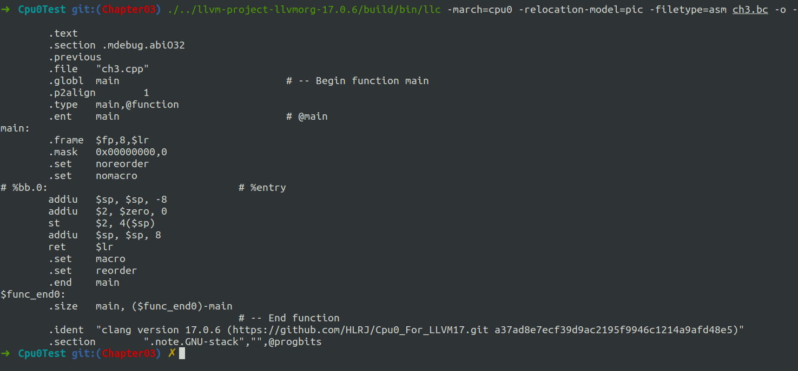
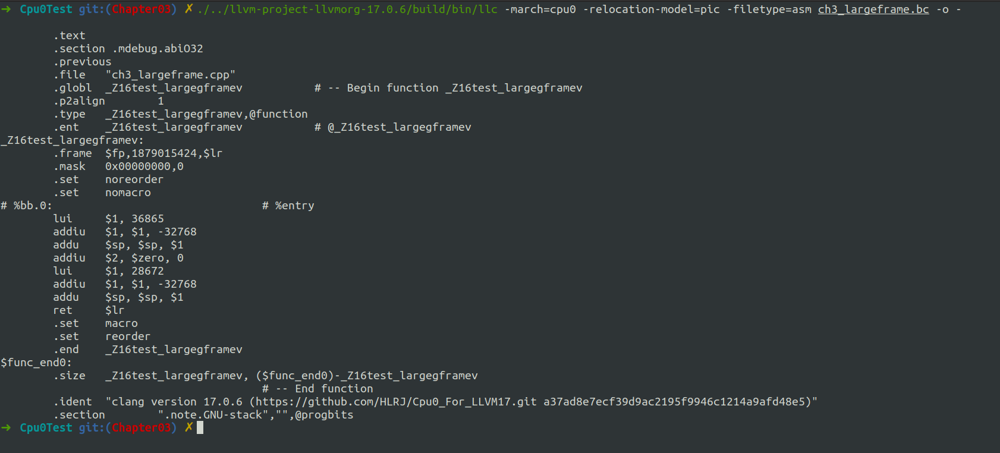

# Overview

Add Prologue/Epilogue functions


# 细节

- Cpu0SEFrameLowering.cpp
- Cpu0SEFrameLowering.h
- Cpu0SEInstrInfo.h
- Cpu0SEInstrInfo.cpp
- Cpu0InstrInfo.td
- Cpu0RegisterInfo.cpp
- Cpu0InstrInfo.h
- Cpu0InstrInfo.cpp
- CMakeLists.txt
- Cpu0AnalyzeImmediate.h
- Cpu0AnalyzeImmediate.cpp
- Cpu0Subtarget.h
- Cpu0MachineFunctionInfo.h


共计13个文件


# 编译

依旧是在build目录下

```shell
cmake -DCMAKE_BUILD_TYPE=Debug         \
        -DBUILD_SHARED_LIBS=ON         \
        -DLLVM_USE_LINKER=lld          \
        -DLLVM_ENABLE_PROJECTS="clang" \
        -DLLVM_TARGETS_TO_BUILD="Mips;Cpu0"   \
        -DLLVM_OPTIMIZED_TABLEGEN=ON   \
        -GNinja ../llvm && ninja
```


进入到Cpu0Test目录下，我们不使用O2级优化，再生成一个ch3.bc
```shell
./../llvm-project-llvmorg-17.0.6/build/bin/clang -target mips-unknown-linux-gnu -c ch3.cpp -emit-llvm -o ch3.bc
./../llvm-project-llvmorg-17.0.6/build/bin/llc -march=cpu0 -relocation-model=pic -filetype=asm ch3.bc -o -
```

结果如下：



测试large stack

```shell
./../llvm-project-llvmorg-17.0.6/build/bin/clang -target mips-unknown-linux-gnu -c ch3_largeframe.cpp -emit-llvm -o ch3_largeframe.bc

./../llvm-project-llvmorg-17.0.6/build/bin/llc -march=cpu0 -relocation-model=pic -filetype=asm ch3_largeframe.bc -o -

```




和书上一致。其他文件自行测试。


