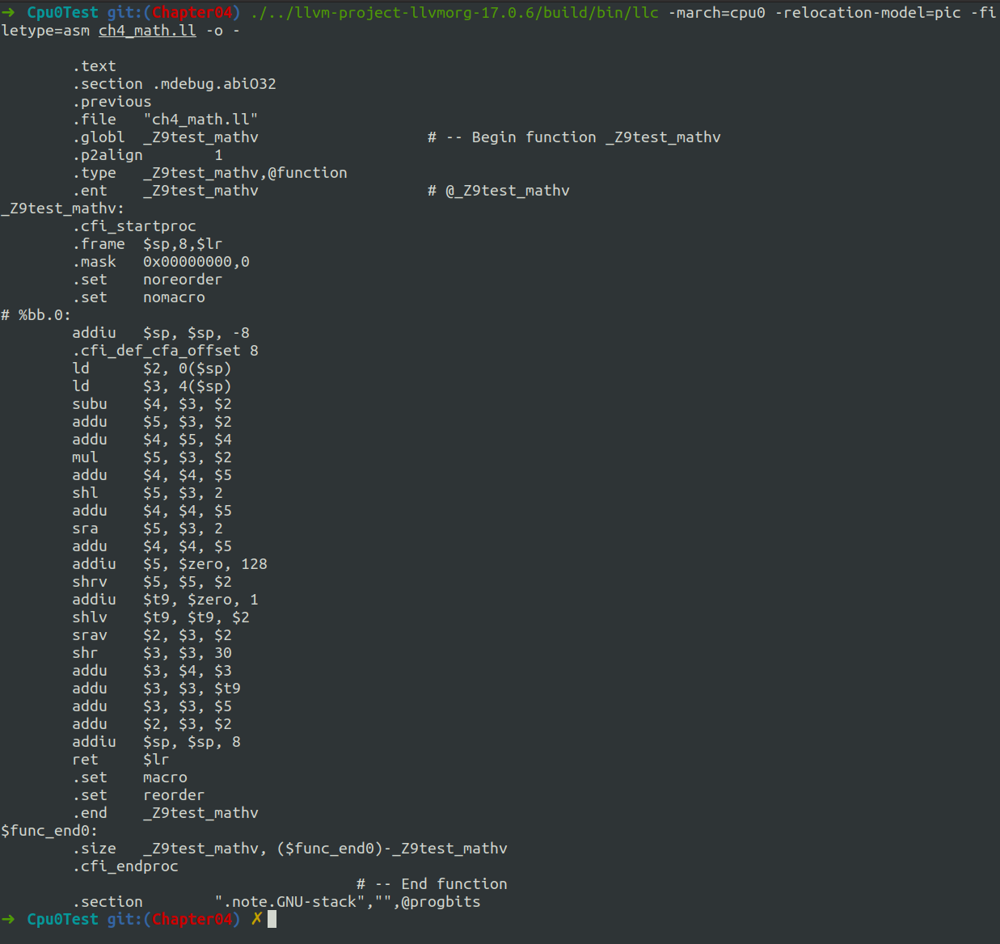

# Overview

To support logic instructions


# 细节

- Cpu0InstrInfo.td
- Cpu0ISelLowering.cpp
- Cpu0Subtarget.h


共计11个文件


# 编译

依旧是在build目录下

```shell
cmake -DCMAKE_BUILD_TYPE=Debug         \
        -DBUILD_SHARED_LIBS=ON         \
        -DLLVM_USE_LINKER=lld          \
        -DLLVM_ENABLE_PROJECTS="clang" \
        -DLLVM_TARGETS_TO_BUILD="Mips;Cpu0"   \
        -DLLVM_OPTIMIZED_TABLEGEN=ON   \
        -GNinja ../llvm && ninja
```


进入到Cpu0Test目录下，我们使用ch4_math.ll
```shell
./../llvm-project-llvmorg-17.0.6/build/bin/clang -target mips-unknown-linux-gnu -c  ch4_1_mod.cpp -emit-llvm -o ch4_1_mod.bc
./../llvm-project-llvmorg-17.0.6/build/bin/llc -march=cpu0 -relocation-model=pic -filetype=asm ch4_1_mod.bc -o -
```

结果如下：




和书上一致。其他文件自行测试。


