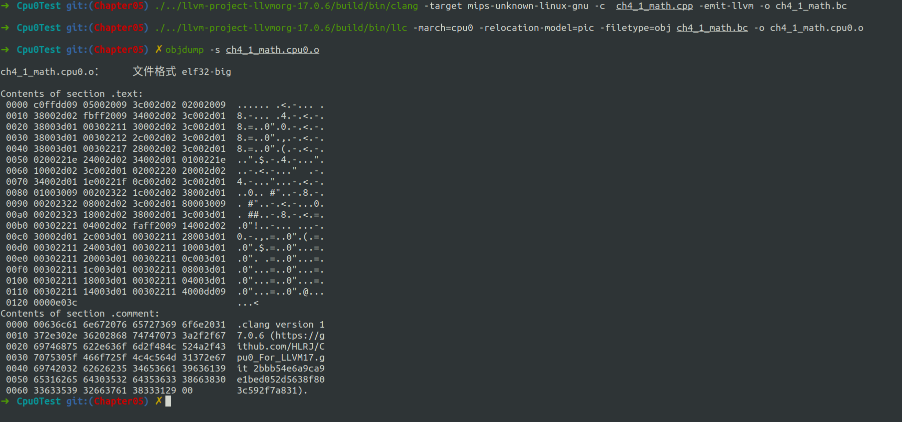
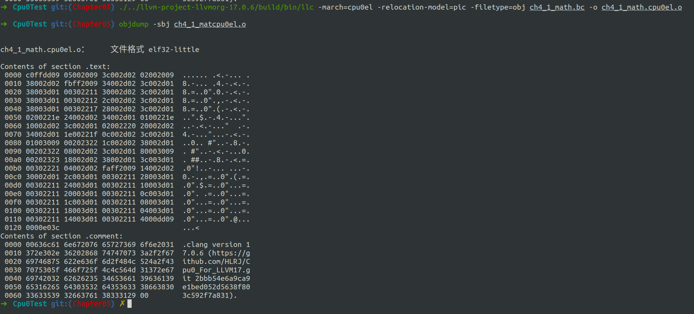

# Overview

生成对象文件


# 细节

- InstPrinter/Cpu0InstPrinter.cpp
- MCTargetDesc/CMakeLists.txt
- MCTargetDesc/Cpu0AsmBackend.h
- MCTargetDesc/Cpu0AsmBackend.cpp
- MCTargetDesc/Cpu0BaseInfo.h
- MCTargetDesc/Cpu0ELFObjectWriter.cpp
- MCTargetDesc/Cpu0FixupKinds.h
- MCTargetDesc/Cpu0MCCodeEmitter.h
- MCTargetDesc/Cpu0MCCodeEmitter.cpp
- MCTargetDesc/Cpu0MCExpr.h
- MCTargetDesc/Cpu0MCExpr.cpp
- MCTargetDesc/Cpu0MCTargetDesc.h
- MCTargetDesc/Cpu0MCTargetDesc.cpp
- MCTargetDesc/Cpu0TargetStreamer.cpp
- Cpu0MCInstLower.h
- Cpu0TargetStreamer.h
- Cpu0Subtarget.h


共计17个文件


# 编译

依旧是在build目录下

```shell
cmake -DCMAKE_BUILD_TYPE=Debug         \
        -DBUILD_SHARED_LIBS=ON         \
        -DLLVM_USE_LINKER=lld          \
        -DLLVM_ENABLE_PROJECTS="clang" \
        -DLLVM_TARGETS_TO_BUILD="Mips;Cpu0"   \
        -DLLVM_OPTIMIZED_TABLEGEN=ON   \
        -GNinja ../llvm && ninja
```


进入到Cpu0Test目录下，我们使用ch4_math.ll，输入以下命令
```shell
./../llvm-project-llvmorg-17.0.6/build/bin/clang -target mips-unknown-linux-gnu -c  ch4_1_math.cpp -emit-llvm -o ch4_1_math.bc
./../llvm-project-llvmorg-17.0.6/build/bin/llc -march=cpu0 -relocation-model=pic -filetype=obj ch4_1_math.bc -o ch4_1_math.cpu0.o
objdump -s ch4_1_math.cpu0.o
```

结果如下：




```shell
./../llvm-project-llvmorg-17.0.6/build/bin/llc -march=cpu0el -relocation-model=pic -filetype=obj ch4_1_math.bc -o ch4_1_math.cpu0el.o
objdump -s ch4_1_math.cpu0el.o
```

结果如下：


