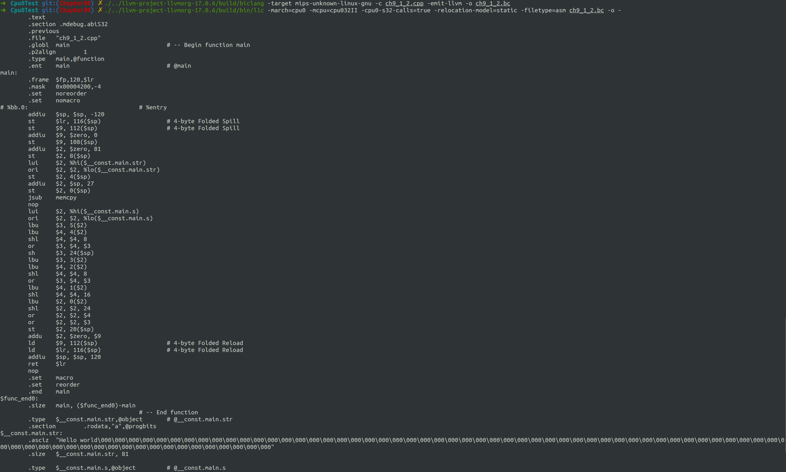

# Overview

函数调用

# 细节


- Cpu0SEISelLowering.cpp
- Cpu0SEISelLowering.h

- Cpu0InstrFormats.td
- Cpu0MCInstLower.cpp
- Cpu0SEFrameLowering.cpp
- Cpu0SEFrameLowering.h
- MCTargetDesc/Cpu0AsmBackend.cpp
- MCTargetDesc/Cpu0ELFObjectWriter.cpp
- MCTargetDesc/Cpu0FixupKinds.h
- MCTargetDesc/Cpu0MCCodeEmitter.cpp

- Cpu0FrameLowering.cpp
- Cpu0FrameLowering.h
- Cpu0ISelLowering.cpp
- Cpu0ISelLowering.h
- Cpu0InstrInfo.cpp
- Cpu0InstrInfo.td
- Cpu0Subtarget.h
- Cpu0MachineFunction.h
- Cpu0MachineFunction.cpp

- Cpu0AsmPrinter.h
- Cpu0AsmPrinter.cpp


共计21个文件


# 编译

依旧是在build目录下

```shell
cmake -DCMAKE_BUILD_TYPE=Debug         \
        -DBUILD_SHARED_LIBS=ON         \
        -DLLVM_USE_LINKER=lld          \
        -DLLVM_ENABLE_PROJECTS="clang" \
        -DLLVM_TARGETS_TO_BUILD="Mips;Cpu0"   \
        -DLLVM_OPTIMIZED_TABLEGEN=ON   \
        -GNinja ../llvm && ninja
```


进入到Cpu0Test目录下，以ch9_1_2.cpp为例，输入以下命令
```shell
./../llvm-project-llvmorg-17.0.6/build/bin/clang -target mips-unknown-linux-gnu -c ch9_1_2.cpp -emit-llvm -o ch9_1_2.bc

./../llvm-project-llvmorg-17.0.6/build/bin/llvm-dis ch9_1_2.bc -o -

./../llvm-project-llvmorg-17.0.6/build/bin/llc -march=cpu0 -mcpu=cpu032II -cpu0-s32-calls=true -relocation-model=static -filetype=asm ch9_1_2.bc -o -
```

结果如下：




note: 这部分其实合并了书上本章节的part1和part2


